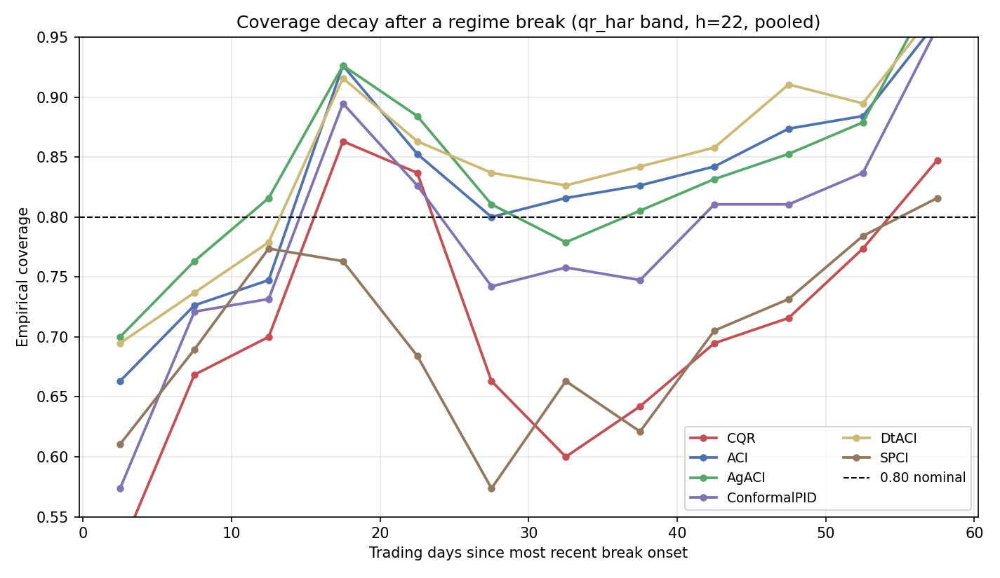
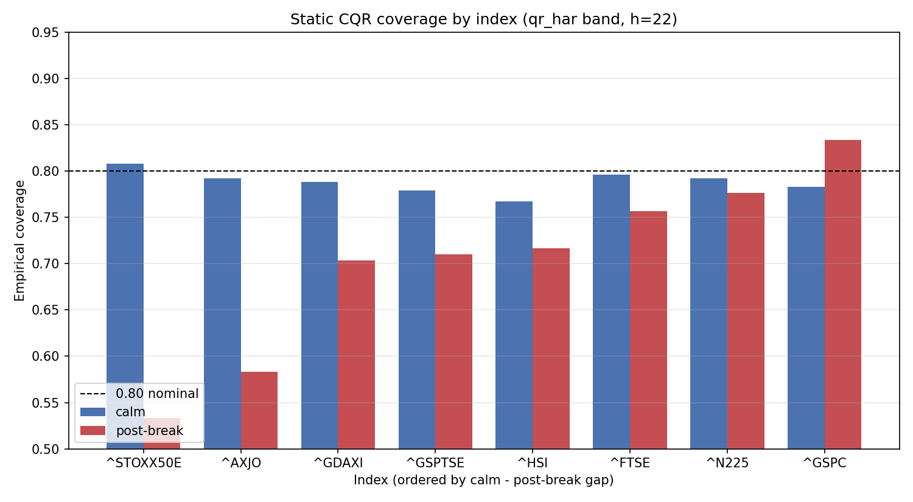

# Conformal calibration of realised volatility through regime breaks

Prediction intervals on realised volatility forecasts hold their stated coverage in calm markets but lose it in the weeks after a regime break, and the misses cluster inside the break windows rather than spreading out. This holds across eight world equity indices from 2008 to 2026, and it is the same whether the underlying forecaster is a three term HAR model or a Temporal Fusion Transformer. Adaptive conformal methods restore coverage on both without widening the intervals in calm periods.

## The question

A forecast of volatility is more useful as an interval than a point. An 80% interval promises that realised volatility lands inside it 80% of the time. That promise is easy to keep on average and easy to break exactly when it matters, in the dislocation after a shock. This project measures whether the promise holds in the 60 trading days after six named breaks, from the 2008 crisis to the 2022 rate shock, against how it holds in calm periods, and tests whether adaptive conformal methods keep it.

## What it finds

At the 22 day horizon the static interval covers 0.787 in calm periods and 0.711 in the post break windows, a 7.7 point drop measured on 11,400 out of sample points. The Christoffersen independence test rejects in every configuration after Benjamini-Hochberg control, so the post break misses are clustered in time, not merely more frequent. The failure is not uniform across markets: the S&P 500 holds its coverage through breaks, while the continental European and Australian indices fail hardest, the STOXX 50 losing 27 points. Replacing the HAR forecaster with a Temporal Fusion Transformer changes none of this, the transformer band fails through breaks at the same rate, which places the failure in the conformal calibration under regime change rather than in the choice of forecaster. The adaptive methods, Conformal PID and DtACI, pull post break coverage back to near 0.80 on both bands, and the calm interval width stays within 1.25 times the static base, so the correction does not come at the cost of useless intervals the rest of the time.

## Method

The hypotheses, break dates, horizons and thresholds were fixed and committed before any result was computed. Forecasts are evaluated on a rolling walk forward with a 44 day embargo between calibration and test to prevent overlap leakage. Coverage is tested with the Kupiec proportion of failures test and the Christoffersen conditional coverage and independence tests, and the false discovery rate is controlled with Benjamini-Hochberg at 0.10 across the full family of index by horizon by method tests. Every run is seeded and deterministic, and the dependencies are pinned, so the result reproduces.

## Scope

This is a calibration and model risk result, not a trading strategy. It does not forecast returns or generate alpha. What it shows is that the confidence attached to a volatility forecast quietly stops being trustworthy in the conditions where it is most relied on, and that an adaptive conformal layer restores it.
